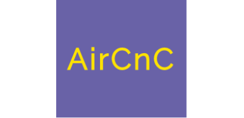
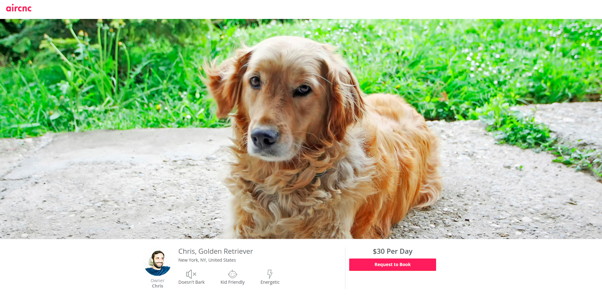

  

# AirCnC

A beautiful UI template for dog renting site.

---

   

## Motivation

Create this website mainly for fun purposes and also to help others to start their journey in web developement.

## Screenshots

## Languages Used

**Built with**

1. [HTML5](https://developer.mozilla.org/en-US/docs/Web/HTML)
1. [CSS3](https://developer.mozilla.org/en-US/docs/Web/css)

## How to use?

If you want to use this UI check this [link](https://debajit13.github.io/AirCnC/) and edit the code as your need.

## Want To Be a Contributor?

Read [CONTRIBUTING.md](./CONTRIBUTING.md) for contribution guidelines.

Made with :heart: and :coffee: by Debajit Mallick

